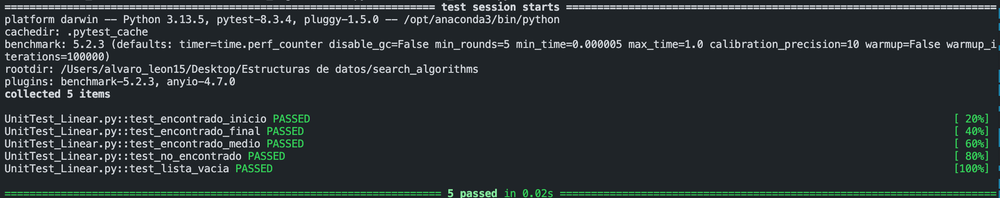

# search_algorithms
Actividad no. 10: Algoritmos de Búsqueda

### Unit test — búsqueda lineal


### Unit test — búsqueda binaria


### Benchmark

Implementación y benchmarking de algoritmos de búsqueda lineal y binaria.

## Clonar el repositorio

```bash
git clone https://github.com/<usuario>/search_algorithms.git
cd search_algorithms
pip install pytest pytest-benchmark
```

## Ejecutar unit tests

```bash
# Búsqueda lineal
pytest UnitTest_Linear.py -v

# Búsqueda binaria
pytest UnitTest_Binary.py -v
```

## Ejecutar benchmarking

```bash
pytest Benchmark.py -v
```